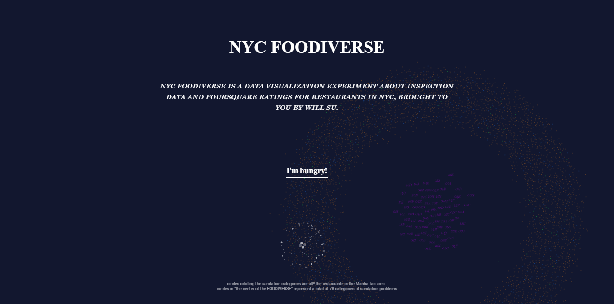

_This is a template for your homework assignments_
// lowercase items are ones you fill in with relevant data

### date
### name
### course name
### assignment title, [link to assignment in syllabus](https://github.com/sva-dsi/2016-fall-course/blob/master/syllabus.md#assignment)

## 

here you can explain in one ¶ with complete sentences what your evaluation/analysis/thoughts are on some topic

## RESOURCES

here you can list resources using any citation schema that suits, here are some examples:

* [MLA](https://owl.english.purdue.edu/owl/resource/747/01/)
* [APA](https://owl.english.purdue.edu/owl/resource/560/01/)

this template is written in markdown, you can read more about the [syntax here](http://daringfireball.net/projects/markdown/basics).

## IMAGE

!git add firstassignment.png

**Source for graphic**: Ford, P., [_What is code?_](http://www.bloomberg.com/graphics/2015-paul-ford-what-is-code/).
